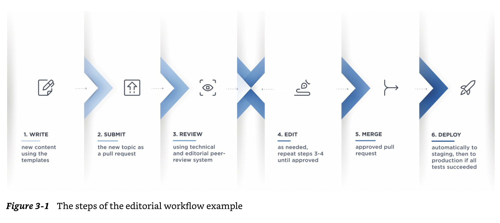
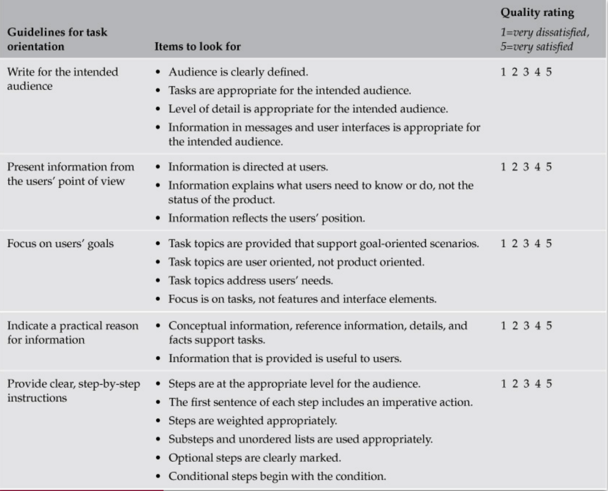

# Writing to Guide Actions

This repo is a tiny, tiny snippet of the [Github Desktop](https://docs.github.com/en/desktop) user documentation ecosystem. Check out [their GH repo](https://github.com/github/docs/tree/main/content/desktop), where the GH team uses a docs-as-code methodology and editorial workflow to create and maintain their documentation.

In teams, you are going to practice Lakatos' editorial workflow on Github, as seen in the figure below (p. 81).

1. Write
2. Submit
3. Review
4. Edit
5. Merge
6. Deploy

## Learning Objectives

In this assignment, you will reinforce the following knowledge and skills:

- What an editorial workflow is and how it benefits your documentation
- The steps of an editorial workflow through a real-life example and what happens at each step
- How you can extend your editorial workflow with issue management
- How to revise and discuss procedural content with criteria from the WTGA moves and task orientation.

## What To Do

### 1. Delegate a particular procedure to each team member

1. Open the [Getting started with Github Desktop](content/desktop/overview/getting-started-with-github-desktop.md) document and navigate to the following section: "*Part 3: Contributing to projects with Github Desktop*."

2. Delegate one of the procedures referenced and linked in Part 3 to each team member. The team member will be responsible for making any edits to this procedure.

   1. **Creating, adding, and cloning repositories**
      1. Create a new repository
      2. Add a new repository
      3. Clone a repository

   2. **Making changes in a branch**
      1. Managing branches in Github Desktop
      2. Committing and reviewing changes to your project in Github Desktop
      3. Pushing changes to Github from Github Desktop

### 2. Practice the DAC editorial workflow

1. **WRITE/REVISE** your assigned file:
   * Practice the DAC editorial workflow. Be sure to create a new branch before you begin your editing work.

2. **SUBMIT** a pull request:
   * When you think your edit is ready to share with your team, create a pull request.
     * Follow Lakatos' guidelines about what information should be included (pp. 77-78): Issue title, Description, Mentions, Label, and Assignees.
     * **NOTE**: Some of these techniques are advanced, such as using *References*, *Projects*, and *Milestones*. Please ignore these for now.

3. **REVIEW** and deliberate about the revisions:
   * Teams should discuss the edits by using the shared criteria from Bellamy et al. (task orientation) and Hart-Davidson (Staging, Coaching, and Alerting).
      
   * As you discuss, 
     * Communicate the reasons behind your judgement of the writing and editing by drawing from the above criteria. 
     * Use the SCA terms to indicate what types of moves you changed, and
     * Use the TO language and scoring to discuss what you thought needed revision, why, and why you think it is better now.
   * If needed, suggest at least one additional change before you all agree to merge the pull request into the main branch.

4. **DEPLOY** the agreed upon changes: 
   * The person who made the changes will be responsible for merging them into the main branch.

## Possible Discussion Questions to Consider Before Class

- What is your overall impression of the docs-as-code editorial workflow with Github and Markdown so far? Please jot down some specific triumphs, pitfalls, and questions to bring to class.
- (How) Did the shared criteria about task orientation and WTGA help or hinder your editing, writing, and team discussions? Jot down a specific instance for class discussion.

## FYI - You Can Contribute to GH's Docs

If you start developing a good sense of the editorial workflow, and take some extra steps to learn about Github's docs-as-code approach, then you can gain some experience and contribute to their docs. Cool, huh?!

Check out this blurb from their repo's README to learn more about it:

  > We accept different types of contributions, including some that don't require you to write a single line of code. For detailed instructions on how to get started with our project, see "[About contributing to GitHub Docs](https://docs.github.com/en/contributing/collaborating-on-github-docs/about-contributing-to-github-docs)."
  ...
  If you're looking for a way to contribute, you can scan through our [help wanted board](https://github.com/github/docs/issues?q=is%3Aopen+is%3Aissue+label%3A%22help+wanted%22) to find open issues already approved for work.
